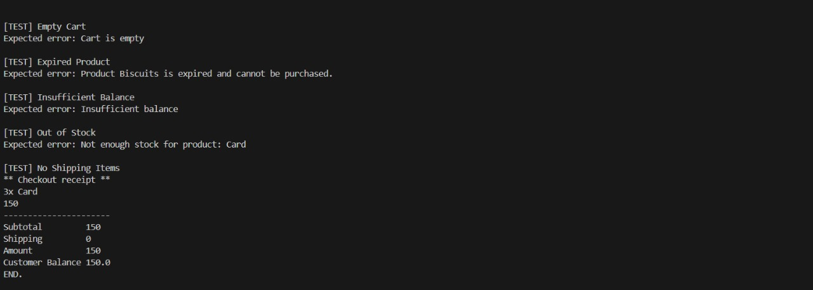
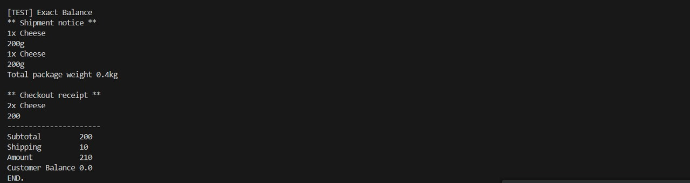

# Fawry E-commerce Checkout System

This project simulates a checkout system for an e-commerce platform, developed as part of the Fawry Rise Internship Challenge.

##  Features

- Define products with name, price, and quantity.
- Handle expirable and non-expirable products.
- Manage shippable and non-shippable items.
- Add products to a cart with quantity constraints.
- Calculate order subtotal, shipping fees, and total amount.
- Deduct balance from the customer upon checkout.
- Generate:
    - Shipment Notice (for shippable items).
    - Checkout Receipt.

##  Test Coverage

Test cases are located in `CheckoutTests.java`. They include:

- ✅ Valid checkout with mixed products.
- ❌ Expired product.
- ❌ Out of stock.
- ❌ Empty cart.
- ❌ Insufficient balance.
- ✅ Exact balance match.
- ✅ No shipping needed.

## 🖼 Test Output Example

### **Shipment Notice**
```
1x Cheese
200g
1x Biscuits
700g
Total package weight: 0.9kg
```

### **Checkout Receipt**
```
2x Cheese      200
1x Biscuits    150
----------------------
Subtotal         350
Shipping         30
Amount           380
Customer Balance 620.0
```

##  Project Structure

```
src/
├── main/
│   └── java/
│       └── com/
│           └── fawry/
│               ├── models/        // Product, Cart, CartItem, Customer, Cart
│               ├── services/      // CheckoutService, ShippingService
│               ├── constants/     // AppConstants (FEES)
│               ├── interfaces/    // Shippable, Expiry, Shipping
│               └── tests/         // CheckoutTests.java
```

##  How to Run

1. Compile the project:
     ```
     javac -d out src/main/java/com/fawry/**/*.java
     ```
2. Run the tests:
     ```
     java -cp out com.fawry.tests.CheckoutTests
     ```
## Results of tests 


